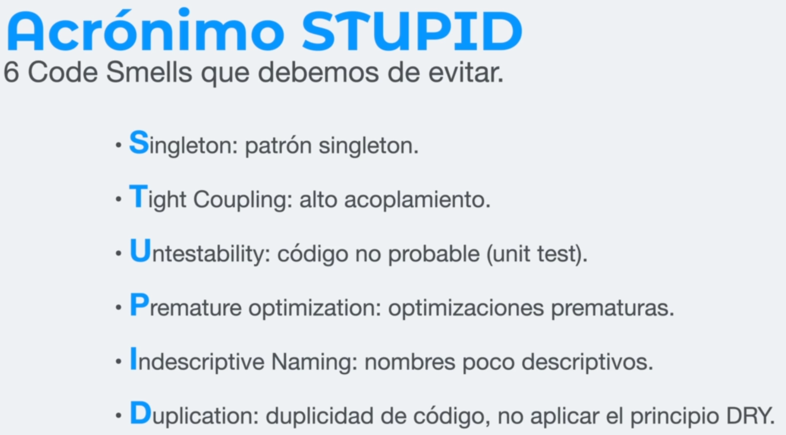
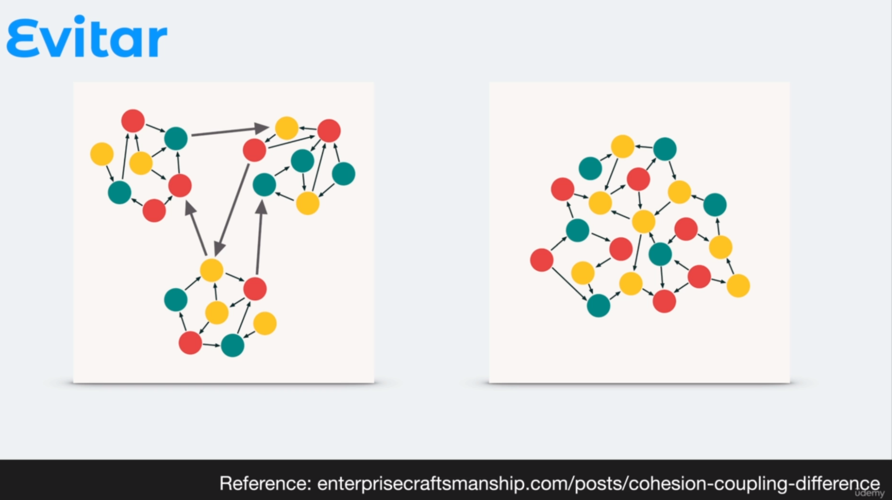

## 01 - Names

### Names

- use English names.
- should easily define their content or function.

### Arrays

- do not include "List" in the name if it is a list or array.
- should easily define their content or function.
- .

### Boolean

- use positive values to define the name, semantic meaning.
- should easily define their function.
- .

### Numbers

- .

### Functions

- must repress action: verb of the action + noun.
- descriptive noun.
- | Bad                             | Good                             |
  | ------------------------------- | -------------------------------- |
  |  |  |

<hr>

## 02 - Names

<hr>

## 02 - Classes

- Names made up of substantives or substantive noun phrases, avoid generic names.
- Names not too generic.
- Upper camel case.
- consistent relationship to the number of words in a name.

## Queries

- What does this class do?.
- How does this class perform the task?.
- Is the location of this class correct?.
- If something doesn't make sense, remove it or refactor it.

<hr>

## 03 - Functions

- Limit to 3 params, if there are more, use an object to send the params.
- sort the parameters alphabetically.
- simple design or structure
- small size
- functions of less than 20 lines of code
- avoid use of `else`.
- prioritize the use of ternary conditionals
- examples:

  ```TS
    const getPayAmount = ({
      isDead = false,
      isSeparated = true,
      isRetired = false,
    }) => {
      let result;
      if (isDead) {
        result = 1500;
      } else {
        if (isSeparated) {
          result = 2500;
        } else {
          if (isRetired) {
            result = 3000;
          } else {
            result = 4000;
          }
        }
      }
      return result;
    };
  ```

  ```TS
    interface getPayAmountV2Props {
      isDead: boolean;
      isSeparated: boolean;
      isRetired: boolean;
    }

    const getPayAmountV2 = ({
      isDead = false,
      isSeparated = true,
      isRetired = false,
    }: getPayAmountV2Props): number => {
      if (isDead) {
        return 1500;
      }

      if (isSeparated) {
        return 2500;
      }

      return isRetired ? 3000 : 4000;
    };
  ```

  ```TS
  function isRedFruit(fruit: string): boolean {
      if (fruit === "manzana" || fruit === "cereza" || fruit === "ciruela") {
        return true;
      } else {
        return false;
      }
    }
  ```

  ```TS
    function isRedFruitV2(fruit: string): boolean {
      const redFruits: string[] = ["manzana", "cereza", "ciruela"];
      return redFruits.includes(fruit?.toLowerCase());
    }
  ```

  ```TS
    function getFruitsByColor(color: string): string[] {
      if (color === "red") {
        return ["manzana", "fresa"];
      } else if (color === "yellow") {
        return ["piña", "banana"];
      } else if (color === "purple") {
        return ["moras", "uvas"];
      } else {
        throw Error("the color must be: red, yellow, purple");
      }
    }
  ```

  ```TS
    type FruitColor = "red" | "yellow" | "purple";

    function getFruitsByColorV2(color: FruitColor): string[] | Error {
      type FruitsByColor = {
        [key in FruitColor]: string[];
      };
      const fruitsByColor: FruitsByColor = {
        red: ["manzana", "fresa"],
        yellow: ["piña", "banana"],
        purple: ["moras", "uvas"],
      };

      if (!Object.keys(fruitsByColor).includes(color)) {
        throw Error("the color must be: red, yellow, purple");
      }

      return fruitsByColor[color];
    }
  ```

  

  ```TS
    function workingSteps() {
      if (isFirstStepWorking === true) {
        if (isSecondStepWorking === true) {
          if (isThirdStepWorking === true) {
            if (isFourthStepWorking === true) {
              return "Working properly!";
            } else {
              return "Fourth step broken.";
            }
          } else {
            return "Third step broken.";
          }
        } else {
          return "Second step broken.";
        }
      } else {
        return "First step broken.";
      }
    }
  ```

  ```TS
    function workingStepsV2() {
      if (isFirstStepWorking !== true) {
        return "First step broken.";
      }

      if (isSecondStepWorking !== true) {
        return "Second step broken.";
      }

      if (isThirdStepWorking !== true) {
        return "Third step broken.";
      }

      if (isFourthStepWorking !== true) {
        return "Fourth step broken.";
      }

      return "Working properly!";
    }
  ```

<hr>

## STUPID



### low coupling, high cohesion



<hr>

## SOLID Principles


### Single Responsibility Principle


### Open & Close Principle


### Liskov


<hr>

### Installation

- check [this](./docs/README.md) document
