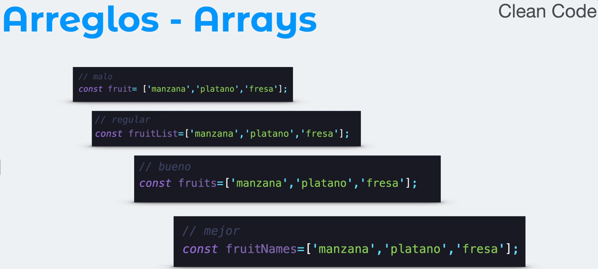
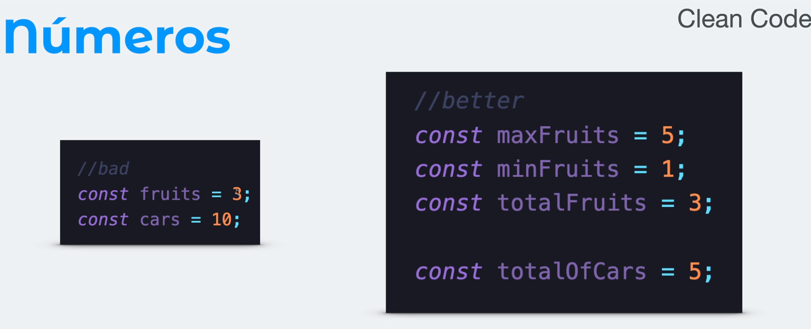
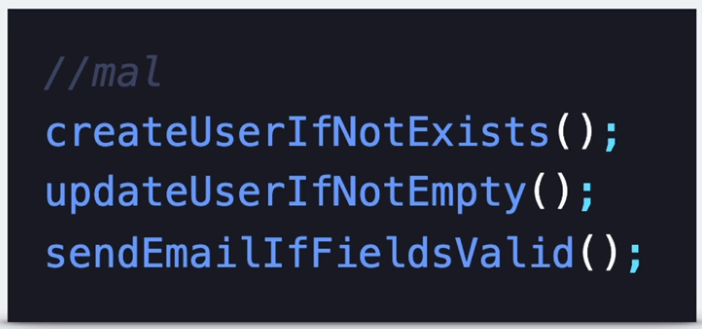
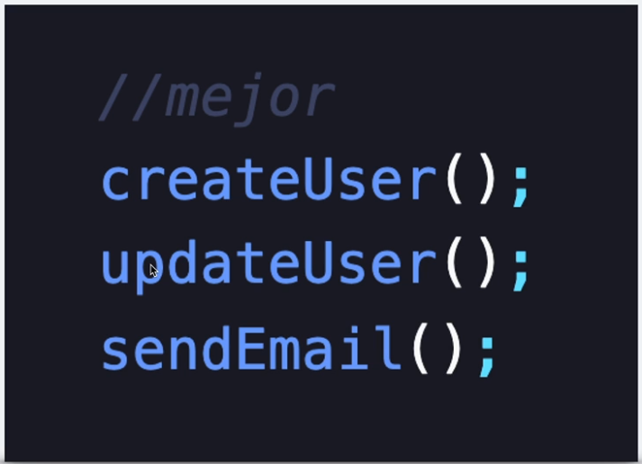

### Names
- use English names
- should easily define their content or function

### Arrays
- do not include "List" in the name if it is a list or array
- should easily define their content or function
- 

### Boolean
- use positive values to define the name, semantic meaning
- should easily define their function
- 

### Numbers
- 

### Functions
- must repress action: verb of the action + noun
- descriptive noun
- | Bad | Good |
  | -- | -- |
  |  |  |